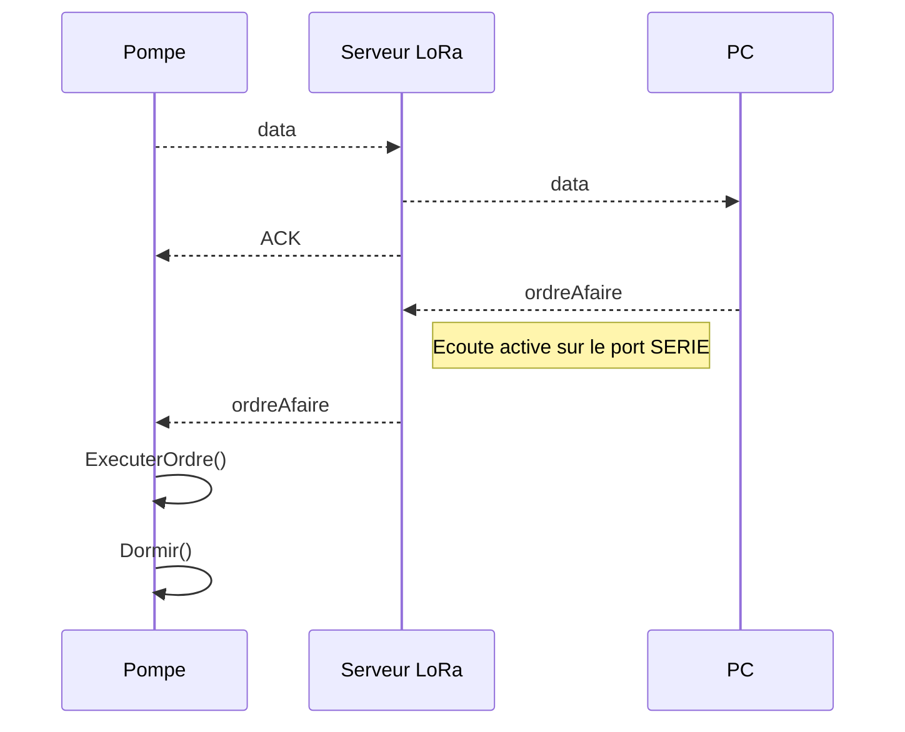

# ReadME LoRA

## Contexte

Ce dépôt github a été réalisé pour un projet de 4eme année en RICM à Polytech Grenoble.

[Lien vers le projet](http://air.imag.fr/index.php/Projets-2016-2017-Station_de_pompage_connect%C3%A9e)

Le projet permet d'équiper une cuve de capteur afin de pouvoir mesurer le niveau. Ce dernier est ensuite envoyé dans une base de donnée. 
Une application permet de voir ces données, et aussi d'activer à distance, l'activation d'une pompe relier à la cuve jusqu'au remplissage demandé.

Les cartes communiques actuellement en **865 MHz**.

La partie LoRA est séparée en deux applications:

* **SX1272Pump** : programme de la carte reliée à la pompe. 
Lien vers le dépôt : https://developer.mbed.org/users/chevamax/code/SX1272Pump/

* **SX1276Server** : permet de communiquer avec la base de donnée via un set de fichier php.
Lien vers le dépôt : https://developer.mbed.org/users/chevamax/code/SX1276Server/

## Application partie Pompe
**Carte utilisée** : [ST-Nucleo-F411RE](https://developer.mbed.org/platforms/ST-Nucleo-F411RE/ "Site MBED")
**Extention LoRa** : [SX1272MB2xAS](https://developer.mbed.org/components/SX1272MB2xAS/ "Site MBED")

Cette application permet de communiquer avec une unique station. Pour choisir l'**ID** de la station, il faut changer **ID_STATION** dans le programme. Il faut impérativement que celui-ci tienne sur un seul octet.

### Branchements pour la simulation
Une foi en route, la carte va instantanément envoyer le niveau de la cuve en LoRa. Il faut donc brancher l'alimentation en dernier.

Vous trouverez ci-dessous le modèle de branchement pour simuler les capteurs, et la sortie d'activation de la pompe (ici représenté par une LED).

### Informations
* Le temps d'attente entre deux mesures doit être modifier par la variable **SLEEP_TIME**. Attention, vous devez respecter la règle des 1%.
* La carte **ne supporte pas** le réveil du DeepSleep par un timer. Le reveil par une source extérieure est cependant possible (un exemple est disponible par appuis sur le bouton). Nous utilisons donc seulement un sleep.
* Les erreurs CRC n'ont pas été traitées.

## Application partie serveur
**Carte utilisée** : [ST-Nucleo-L152RE](https://developer.mbed.org/platforms/ST-Nucleo-L152RE/ "Site MBED")
**Extention LoRa** : [SX1276MB1MAS](https://developer.mbed.org/components/SX1276MB1xAS/ "Site MBED")

Cette application permet de communiquer avec différentes cartes. Tant que le format de trame est celui demandé, et que **ID_STATION** de la trame correspond à l'**ID** courant, la carte communiquera les informations, via le port **SERIE**.

### Informations
* Cette carte ne retient pas le programme lorsqu'elle est débranchée d'une source d'allimentation.
* Lorsque l'affichage du débug est activé, il ne faut pas activer l'interface java.
* "The standard setup for the USB Serial Port is 9600 baud, 8 bits, 1 stop bit, no parity (aka 9600-8-N-1)", [configuration de la connection série](https://developer.mbed.org/handbook/Terminals "Site MBED").

## Protocole de communication
### Format d'une trame de donnée

Les trames envoyées par la carte relié à la cuve ont le format ci-dessus puis sont receptionnées par la carte LoRA Serveur. Elles sont ensuite transmises tel-quelle sur le port **SERIE**.

### Format d'une trame d'activation de la pompe

Ce type de trame est envoyée sur le port **SERIE** de la carte côté serveur. Si le bit d'ordre est positionné à **1**, la trame est alors envoyé à la carte d'ID "Identifiant de la carte LoRA récptrice".

### Diagramme de communication simplifié

